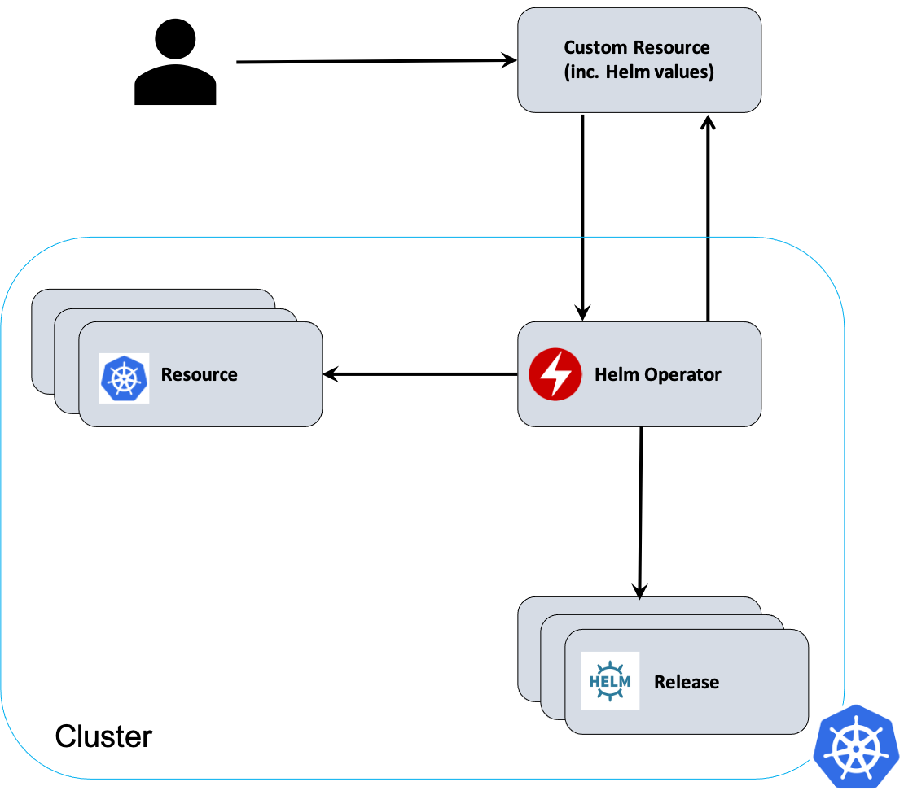

# How to create an operator using an existing Helm chart

## Overview

The Helm [operator](https://www.redhat.com/en/topics/containers/what-is-a-kubernetes-operator) provides a [custom resource](https://kubernetes.io/docs/concepts/extend-kubernetes/api-extension/custom-resources/) (CR) to declaratively describe Helm releases using a Helm [chart](https://helm.sh/docs/topics/charts/). This means that a user can deploy a Helm chart by deploying a CR which contains the chart values. The operator manages the deployment of the chart and also reconciles the release and the actual deployed resources so that they are in sync on the cluster.

The diagram below gives an conceptual view of how the Helm operator works:



The [Operator SDK](https://sdk.operatorframework.io/docs/overview/) is an open source toolkit to help write operators and it will be used to create and deploy the operator in this `how to`. Any Helm chart can be used to create a Helm operator. For this we will use the [WordPress chart](https://github.com/bitnami/charts/tree/master/bitnami/wordpress) as the example.

> Note: The operator will install the Helm chart using the [Helm Go SDK](https://helm.sh/docs/topics/advanced/#go-sdk). This means any configuration or set-up of the cluster needed to install the chart using Helm, would also be required by the operator. It would therefore be beneficial to install and uninstall it first using the Helm binary before starting with the operator to confirm it can be deployed in your cluster.

## Prerequisites

[Helm](https://helm.sh/) uses a packaging format called [charts](https://helm.sh/docs/topics/charts/) to deploy applications more easily to Kubernetes. The [Artifact Hub](https://artifacthub.io/) is a place where you can search for the different charts available and the repositories that host them. Helm can reference charts in a number of ways, including a Helm repository and a chart archive. See the [Helm Install](https://helm.sh/docs/helm/helm_install/) doc for more details.

This `how to` uses the [WordPress chart](https://github.com/bitnami/charts/tree/master/bitnami/wordpress) as an example chart for creating an operator. It is referenced from the local Helm repository list by adding it to the Helm repo list. Follow the steps below if you would like to set it up in this way.

1. Find where the WordPress chart is hosted:

```bash
$ helm search hub wordpress

URL                                               	CHART VERSION	APP VERSION 	DESCRIPTION                                       
https://artifacthub.io/packages/helm/bitnami/wo...	10.6.4       	5.6.1       	Web publishing platform for building blogs and ...
https://artifacthub.io/packages/helm/groundhog2...	0.2.6        	5.6.0-apache	A Helm chart for Wordpress on Kubernetes          
https://artifacthub.io/packages/helm/seccurecod...	2.4.0        	4.0         	Insecure & Outdated Wordpress Instance: Never e...
https://artifacthub.io/packages/helm/presslabs/...	0.10.5       	0.10.5      	Presslabs WordPress Operator Helm Chart           
https://artifacthub.io/packages/helm/presslabs/...	0.10.3       	v0.10.3     	A Helm chart for deploying a WordPress site on ...
https://artifacthub.io/packages/helm/seccurecod...	2.4.0        	latest      	A Helm chart for the WordPress security scanner...
https://artifacthub.io/packages/helm/presslabs/...	0.10.3       	v0.10.3     	Open-Source WordPress Infrastructure on Kubernetes
```

Let's use the Bitnami repository as it is a trusted maintained repository of the chart.

2. Add the Bitnami repository to the local repository list:  

```bash
$ helm repo add bitnami https://charts.bitnami.com/bitnami
"bitnami" has been added to your repositories
```

This now means you can reference the chart with the alias `bitnami/wordpress`.

3. [operator-sdk v1.3.2](https://github.com/operator-framework/operator-sdk/releases/tag/v1.3.2). The commands are correct for this version of the Operator SDK. The comands may change in different major/minor releases.

## Create the operator project

> Note: Do NOT use . for the operator version (--version). [Semantic versioning](https://semver.org/) is not supported for the operator version.

```bash
$ mkdir wordpress-operator

$ cd wordpress-operator

$ operator-sdk init --plugins helm --helm-chart bitnami/wordpress --domain example.com --group helm-chart --version v1 --kind Wordpress

Created helm-charts/wordpress
Generating RBAC rules
WARN[0011] The RBAC rules generated in config/rbac/role.yaml are based on the chart's default manifest. Some rules may be missing for resources that are only enabled with custom values, and some existing rules may be overly broad. Double check the rules generated in config/rbac/role.yaml to ensure they meet the operator's permission requirements.
```

The `operator-sdk init` command initializes a new Helm operator project generating the following artefacts:

- a helm-charts directory with the chart(s) to build releases from
- a watches.yaml file that defines the mapping between your API and a Helm chart
- a PROJECT file with the domain and project layout configuration
- a Makefile to build the project
- a Kustomization.yaml for customizing manifests
- a Patch file for customizing image for manager manifests
- a Patch file for enabling prometheus metrics

## Deploy the operator

1. Build and push the image:

```bash
$ export USERNAME=<docker-registry>

$ make docker-build docker-push IMG=docker.io/$USERNAME/wordpress-operator:v1.0.0 
[...]
```

2. Deploy the operator:

```bash
$ make deploy IMG=docker.io/$USERNAME/wordpress-operator:v1.0.0

cd config/manager && projects/wordpress-operator/bin/kustomize edit set image controller=docker.io/user/wordpress-operator:v1.0.0
projects/wordpress-operator/bin/kustomize build config/default | kubectl apply -f -
namespace/wordpress-operator-system unchanged
customresourcedefinition.apiextensions.k8s.io/wordpresses.helm-chart.example.com created
role.rbac.authorization.k8s.io/wordpress-operator-leader-election-role unchanged
clusterrole.rbac.authorization.k8s.io/wordpress-operator-manager-role unchanged
clusterrole.rbac.authorization.k8s.io/wordpress-operator-metrics-reader unchanged
clusterrole.rbac.authorization.k8s.io/wordpress-operator-proxy-role unchanged
rolebinding.rbac.authorization.k8s.io/wordpress-operator-leader-election-rolebinding unchanged
clusterrolebinding.rbac.authorization.k8s.io/wordpress-operator-manager-rolebinding unchanged
clusterrolebinding.rbac.authorization.k8s.io/wordpress-operator-proxy-rolebinding unchanged
service/wordpress-operator-controller-manager-metrics-service unchanged
deployment.apps/wordpress-operator-controller-manager configured
```

3. Check operator is up and running:

```bash
$ kubectl get deployment -n wordpress-operator-system

NAME                                    READY   UP-TO-DATE   AVAILABLE   AGE
wordpress-operator-controller-manager   1/1     1            1           16m
```

## Deploy Wordpress

1. Create demo WordPress Custom Resource (CR):

> Note: This is equivalent to a [Helm values override file](https://helm.sh/docs/chart_template_guide/values_files/).

- Copy the generated CR manifest:

```bash
$ cp config/samples/helm-chart_v1_wordpress.yaml config/samples/wordpress-demo.yaml
```

- Change the WordPress chart release name from the default generated name:
Update `name: wordpress-sample` to `name: wordpress-demo`

- Change one of the values in the manifest to demonstrate that CR manifest exposes the chart values:
Change `spec.wordpressBlogName` to `The Demo Blog!`. We will check this later when the server is running.

2. Deploy WordPress:

> Note: Verify the version of the bitnami container, the helm chart installs `5.6.1-debian-10-r8` and the newest release is: `5.6.1-debian-10-r9`

```bash
$ kubectl create ns wordpress-demo 
namespace/wordpress-demo created

$ kubectl apply -f config/samples/wordpress-demo.yaml -n wordpress-demo --validate=false
wordpress.helm-chart.example.com/wordpress-demo created
```

> Note: You need to turn of validation (`--validate=false`) because the WordPress Helm chart uses null values for some defaults and this can cause the Kubernetes schema validation to fail. This should not be done in production systems.

3. Verify that WordPress is running:

```bash
$ kubectl get pods -n wordpress-demo

NAME                                  READY   STATUS    RESTARTS   AGE
pod/wordpress-demo-646d4d897d-qzjbz   1/1     Running   0          88m
pod/wordpress-demo-mariadb-0          1/1     Running   0          88m
```

> Note: You can also check that Helm deployed the WordPress chart from the operator:

```bash
$ helm ls -A 

NAME          	NAMESPACE     	REVISION	UPDATED                                	STATUS  	CHART                               	APP VERSION
wordpress-demo	wordpress-demo	1       	2021-02-12 18:30:19.542550642 +0000 UTC	deployed	wordpress-10.6.4                    	5.6.1  
```

4. Check that you can access WordPress:

- The details on how to access the WordPress site are in the chart notes when you deploy the chart. You can get the details in one of two ways:
  
  - Check the operator manager logs for the output with the following command:

    ```bash
    $ kubectl logs deployment.apps/wordpress-operator-controller-manager -n wordpress-operator-system -c manager
    ```

  - Get the notes using the Helm client as follows:

    ```bash
    $ helm get notes wordpress-demo -n wordpress-demo
    ```

- Open a browser and access WordPress using the obtained URL. You should see the updated value of `THE DEMO BLOG!` on the page.

## Clean up

**WARNING:** This command will remove the WordPress deployment, the operator and all other resources created.

```bash
$ kubectl delete -f config/samples/wordpress-demo.yaml -n wordpress-demo
wordpress.helm-chart.example.com "wordpress-demo" deleted

$ make undeploy

projects/operators/helm-charts/wordpress-operator/bin/kustomize build config/default | kubectl delete -f -
namespace "wordpress-operator-system" deleted
customresourcedefinition.apiextensions.k8s.io "wordpresses.helm-chart.example.com" deleted
role.rbac.authorization.k8s.io "wordpress-operator-leader-election-role" deleted
clusterrole.rbac.authorization.k8s.io "wordpress-operator-manager-role" deleted
clusterrole.rbac.authorization.k8s.io "wordpress-operator-metrics-reader" deleted
clusterrole.rbac.authorization.k8s.io "wordpress-operator-proxy-role" deleted
rolebinding.rbac.authorization.k8s.io "wordpress-operator-leader-election-rolebinding" deleted
clusterrolebinding.rbac.authorization.k8s.io "wordpress-operator-manager-rolebinding" deleted
clusterrolebinding.rbac.authorization.k8s.io "wordpress-operator-proxy-rolebinding" deleted
service "wordpress-operator-controller-manager-metrics-service" deleted
deployment.apps "wordpress-operator-controller-manager" deleted

$ kubectl delete -n wordpress-demo --all
persistentvolumeclaim "data-wordpress-demo-mariadb-0" deleted
```

> Note: You first need to uninstall the release before removing the operator as the operator could be stopped before cleanup and can therefore hang the `undeploy` waiting. See [operator-sdk issue](https://github.com/operator-framework/operator-sdk/issues/4383) for more details. As a final step, you will need to cleanup the PersistentVolumeClaim (PVC) that was created when the chart was deployed. This is because Helm does not remove PVCs by design. See [Helm issue](https://github.com/helm/helm/issues/5156) for more details.

## Debugging

- Check the operator manager logs for more details on the deployment of the operator and the chart:

```bash
$ kubectl logs deployment.apps/wordpress-operator-controller-manager -n wordpress-operator-system -c manager
```

- If you are deploying this example to an [IBM Kubernetes Service (IKS) cluster](https://www.ibm.com/cloud/kubernetes-service), you may need to run the following commands first in your Kubernetes cluster:

> Note: Verify your `storageclass` with the following command: `kubectl get storageclass`. If your `(default)` is prefixed with `ibmc-file-`, change all names that apply via the commands below.

```bash
# Get IKS Helm charts
$ helm repo add iks-charts https://icr.io/helm/iks-charts
$ helm repo update

# Install the plugin
$ helm install 1.6.0 iks-charts/ibmcloud-block-storage-plugin -n kube-system

# Make the IBM Cloud Block Storage the default `storageclass`
$ kubectl patch storageclass ibmc-block-gold -p '{"metadata": {"annotations":{"storageclass.kubernetes.io/is-default-class":"true"}}}'
$ kubectl patch storageclass ibmc-file-<name> -p '{"metadata": {"annotations":{"storageclass.kubernetes.io/is-default-class":"false"}}}'
```

- If you are on a Mac and using `homebrew`, and you see the following error when running the `make docker-build docker-push` command:

```bash
[...]
env: Studio: No such file or directory
make: *** [docker-build] Error 127
```

**Action**: Edit the `Makefile` in the `SHELL` line as follows:

```shell
SHELL := env PATH=/usr/local/bin:/usr/bin:/bin:/usr/sbin:/sbin /bin/sh
```

See [operator-sdk bug](https://github.com/operator-framework/operator-sdk/issues/4177) for more details.

- If you are using an OS which does not point `sh` to the `bash` shell (Ubuntu for example), and you see the following error when running the `make docker-build docker-push` command:

```console
failed to start the controlplane. retried 5 times: fork/exec /usr/local/kubebuilder/bin/etcd: no such file or directory occurred
```

**Action**: Add the following line to the top of the Makefile:

```bash
SHELL := /bin/bash
```

See [operator-sdk bug](https://github.com/operator-framework/operator-sdk/issues/4203) for more details.

- WordPress and MariaDB need access for writing to volumes. It uses Kubernetes Security to automatically change the ownership of volumes. Kubernetes Security may not work in some clusters and there might be issues with chart deployment as shown below.

Wordpress may fail with an error similar to the following:

```bash
$ kubectl logs wordpress-demo-566f7497c5-bbqrk -n wordpress-demo

Welcome to the Bitnami wordpress container
Subscribe to project updates by watching https://github.com/bitnami/bitnami-docker-wordpress
Submit issues and feature requests at https://github.com/bitnami/bitnami-docker-wordpress/issues

WARN  ==> You set the environment variable ALLOW_EMPTY_PASSWORD=yes. For safety reasons, do not use this flag in a production environment.
nami    INFO  Initializing apache
nami    INFO  apache successfully initialized
nami    INFO  Initializing mysql-client
nami    INFO  mysql-client successfully initialized
nami    INFO  Initializing wordpress
wordpre INFO  ==> Preparing Varnish environment
wordpre INFO  ==> Preparing Apache environment
wordpre INFO  ==> Preparing PHP environment
mysql-c INFO  Trying to connect to MySQL server
mysql-c INFO  Found MySQL server listening at wordpress-sample-mariadb:3306
mysql-c INFO  MySQL server listening and working at wordpress-sample-mariadb:3306
wordpre INFO  Preparing WordPress environment
Error executing 'postInstallation': EACCES: permission denied, mkdir '/bitnami/wordpress/wp-content'
```

**Action**: Need to set `spec.volumePermissions.enabled` to `true` in CR file and redeploy.

MariaDB may fail with an error similar to the following:

```bash
$ kubectl logs wordpress-demo-mariadb-0 -n wordpress-demo  

Welcome to the Bitnami mariadb container
Subscribe to project updates by watching https://github.com/bitnami/bitnami-docker-mariadb
Submit issues and feature requests at https://github.com/bitnami/bitnami-docker-mariadb/issues
Send us your feedback at containers@bitnami.com
 
INFO  ==> ** Starting MariaDB setup **
INFO  ==> Validating settings in MYSQL_*/MARIADB_* env vars
INFO  ==> Initializing mariadb database
mkdir: cannot create directory '/bitnami/mariadb/data': Permission denied
```

**Action**: Need to set `spec.secondary.volumePermissions.enabled` to `true` in CR file and redeploy.

See this [document](https://github.com/bitnami/charts/tree/master/bitnami/mariadb#adjust-permissions-of-persistent-volume-mountpoint)
for more details.

## References

1. [Operator-SDK Helm doc](https://sdk.operatorframework.io/docs/building-operators/helm/)
2. [operator](https://www.redhat.com/en/topics/containers/what-is-a-kubernetes-operator)
3. [Helm](https://helm.sh/)
